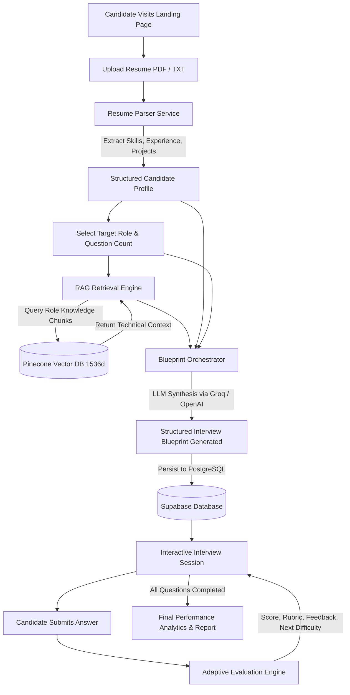
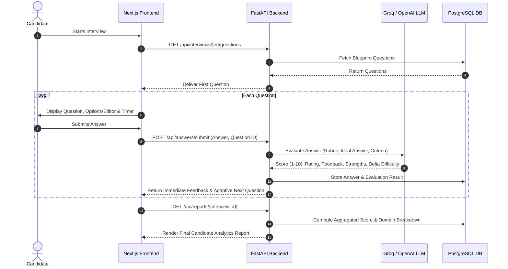
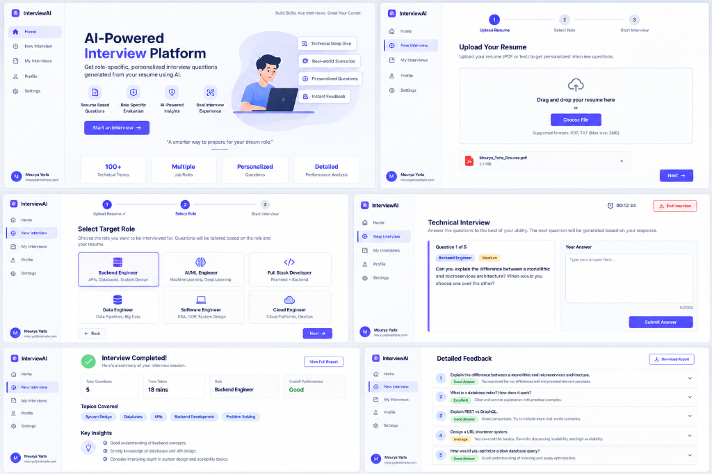
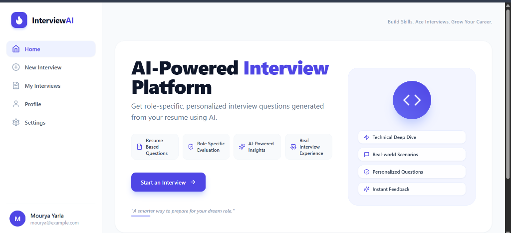
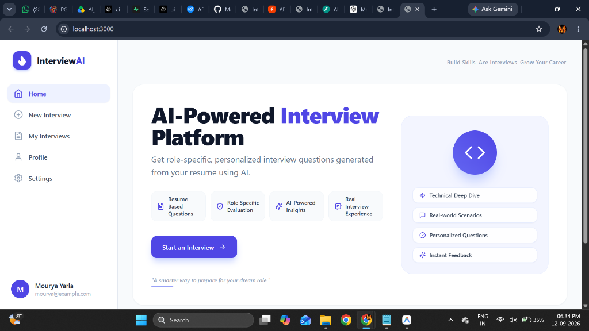
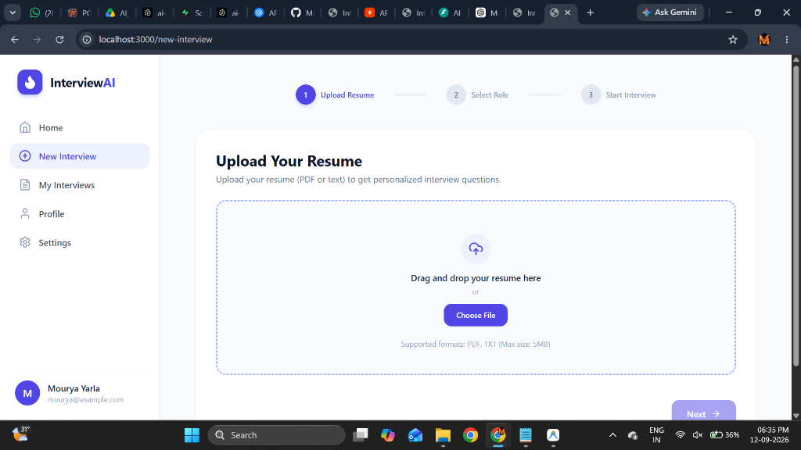
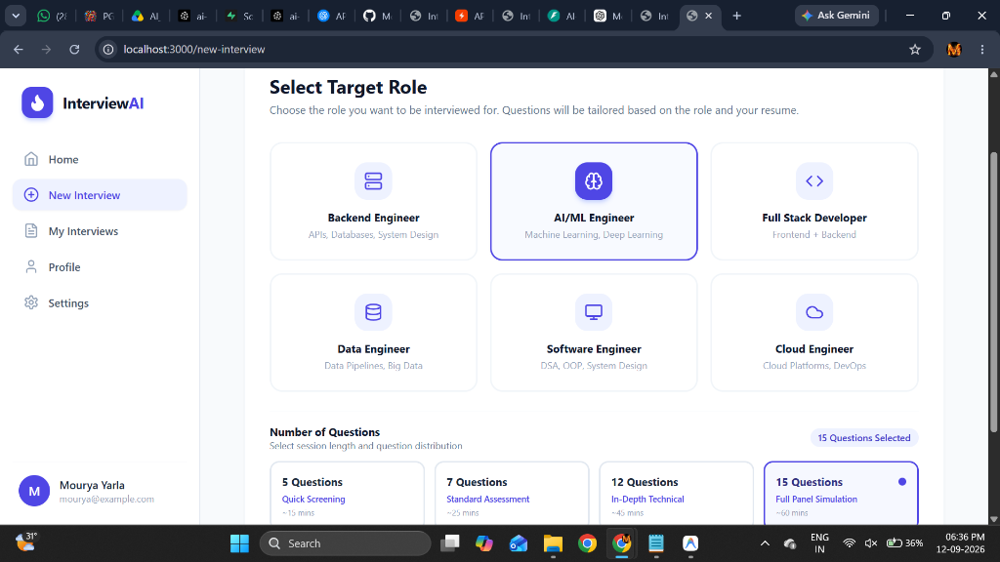
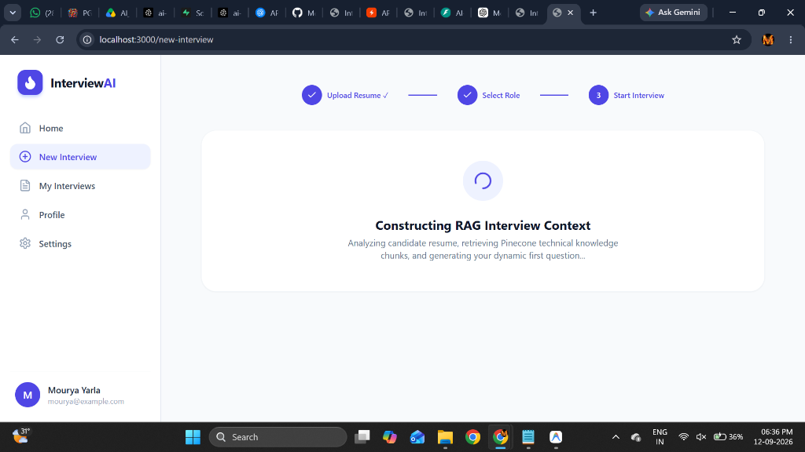
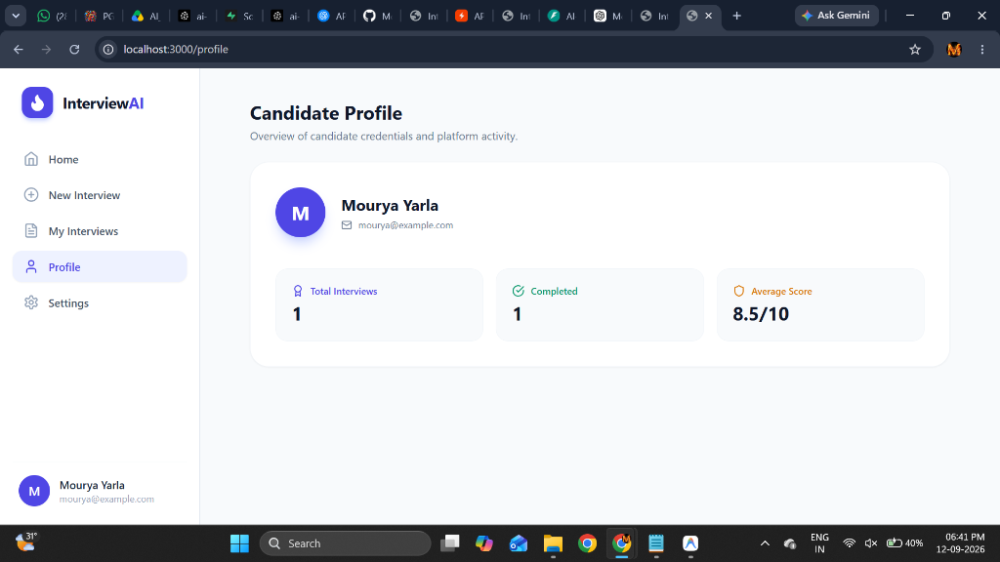

# AI-Powered Role-Based Candidate Screening & Technical Interview Platform
## Comprehensive Technical Documentation & Architecture Manual

---

## 1. Executive Summary & Core Value Proposition

Modern hiring processes suffer from high recruiter workloads, inconsistent interview standards, and superficial question banks. Generic AI interview bots frequently fail because they ask arbitrary trivia, hallucinate irrelevant questions, or ignore the candidate's actual background and target domain.

The **AI-Powered Role-Based Candidate Screening & Technical Interview Platform** is a production-grade, full-stack platform built to automate and calibrate technical hiring. It couples **candidate resume parsing** with **domain-constrained Retrieval-Augmented Generation (RAG)** across role-partitioned technical knowledge bases (Pinecone Vector DB) to dynamically construct customized, upfront interview blueprints and deliver real-time, adaptive technical evaluations.

---

## 2. Technology Stack & Component Justification

The platform employs a decoupled, modular microservice-style architecture separating frontend presentation, backend orchestration, vector similarity search, relational data storage, and multi-model LLM inference.

```
┌─────────────────────────────────────────────────────────────────────────┐
│                        FRONTEND PRESENTATION LAYER                       │
│    Next.js 14+ (App Router) · TypeScript · Tailwind CSS · Lucide React  │
└────────────────────────────────────┬────────────────────────────────────┘
                                     │ JSON REST over HTTPS
                                     ▼
┌─────────────────────────────────────────────────────────────────────────┐
│                       BACKEND ORCHESTRATION LAYER                       │
│        FastAPI (Python 3.11+) · Pydantic V2 · SQLAlchemy 2.0 Async       │
└───────┬───────────────────┬───────────────────┬───────────────────┬─────┘
        │                   │                   │                   │
        ▼                   ▼                   ▼                   ▼
┌──────────────┐    ┌───────────────┐   ┌───────────────┐   ┌───────────────┐
│  PostgreSQL  │    │   Pinecone    │   │  OpenAI API   │   │  Groq Cloud   │
│  (Supabase)  │    │  Vector DB    │   │  Embeddings   │   │  LLM Engine   │
│  Relational  │    │  1536-dim     │   │ text-embed-3  │   │  Llama 3.3    │
│  Data Store  │    │  Cosine Index │   │    -small     │   │   70B Turbo   │
└──────────────┘    └───────────────┘   └───────────────┘   └───────────────┘
```

### 2.1 Frontend Stack
| Technology | Version | Role & Architectural Rationale |
| :--- | :--- | :--- |
| **Next.js** | `14.2.x` | React framework using App Router for server-side layout caching, fast client navigation, and optimized static asset delivery. |
| **TypeScript** | `5.x` | Strict type-safety across candidate profiles, question schemas, interview session states, and evaluation payloads. |
| **Tailwind CSS** | `3.4.x` | Utility-first styling enabling precise pixel-level alignment with Figma specifications (`#4F46E5` indigo/purple theme, slate backgrounds, rounded cards). |
| **Lucide React** | `0.400+` | Clean, modern iconography for status badges, timers, audio indicators, and navigation controls. |
| **Axios** | `1.7.x` | Standardized HTTP client configured with base URLs, timeout policies, and multipart/form-data upload handling. |

### 2.2 Backend Stack
| Technology | Version | Role & Architectural Rationale |
| :--- | :--- | :--- |
| **FastAPI** | `0.111.x` | High-performance Python ASGI web framework with native async I/O, automatic OpenAPI documentation, and dependency injection. |
| **Pydantic V2** | `2.7.x` | High-throughput data validation, serialization, and strict schema enforcement for incoming requests and LLM JSON outputs. |
| **SQLAlchemy** | `2.0.x` | Modern Python SQL toolkit with async engine (`asyncpg` / `psycopg2`) for relational mapping, foreign keys, and atomic transactions. |
| **Uvicorn** | `0.30.x` | Lightning-fast ASGI web server implementation running the Python application. |
| **PyPDF** | `4.2.x` | Robust server-side PDF document parsing and text extraction for uploaded resumes. |

### 2.3 Storage & Cloud Services
| Service / Provider | Specification | Purpose |
| :--- | :--- | :--- |
| **PostgreSQL (Supabase)** | Hosted PostgreSQL 15 | Relational persistence of candidates, interview blueprints, live question logs, candidate answers, and rubric-based evaluations. |
| **Supabase Storage** | S3-compatible private bucket | Secure file storage for raw candidate resume documents (`resumes` bucket) with pre-signed URL access. |
| **Pinecone Vector Database** | Serverless (AWS `us-east-1`) | 1536-dimensional vector index using Cosine metric for millisecond-latency semantic search over role-partitioned technical documentation. |
| **OpenAI Embeddings API** | `text-embedding-3-small` | Generates 1536-dimensional semantic vector representations for candidate queries and ingested knowledge documents. |
| **Groq Cloud API** | `llama-3.3-70b-versatile` | Ultra-low-latency inference engine for question generation, RAG synthesis, and candidate response evaluation. |
| **OpenAI Chat API** | `gpt-4o` / Configurable | Configurable primary/fallback inference engine via environment variables (`OPENAI_MODEL`). |

---

## 3. End-to-End System Flow & Architecture

The application executes a rigorous 5-stage lifecycle from initial candidate entry to final evaluation analytics.



### 3.1 Stage 1: Resume Upload & Deep Extraction
1. Candidate uploads a PDF or TXT file (`<= 5MB`) via the Next.js drag-and-drop interface.
2. The FastAPI backend receives the multipart upload and forwards the raw bytes to Supabase Storage.
3. The `resume_service.py` utilizes `pypdf` to extract raw textual content.
4. An intelligent extraction pipeline parses out:
   - **Candidate Details:** Full name, email, phone, location.
   - **Technical Skills & Frameworks:** Languages, libraries, databases, cloud tools.
   - **AI/ML & Specialized Experience:** Model architectures, RAG frameworks, fine-tuning, training pipelines.
   - **Project Deep-Dives:** Project titles, descriptions, and applied tech stacks.
5. The extracted profile is serialized as structured JSON and stored in the `candidates` table.

### 3.2 Stage 2: Role Selection & Domain Boundary Enforcement
1. The candidate selects from 6 supported engineering tracks:
   - **AI/ML Engineer** (Deep Learning, NLP, RAG, PyTorch, Model Optimization)
   - **Backend Engineer** (Distributed Systems, APIs, Database Scaling, Microservices)
   - **Full Stack Developer** (Frontend Architecture, State Management, REST/GraphQL, Full Lifecycle)
   - **Data Engineer** (ETL/ELT, Data Pipelines, Kafka, Spark, Data Warehouses)
   - **Software Engineer** (Data Structures, Algorithms, OOP, System Design, Concurrency)
   - **Cloud / DevOps Engineer** (Kubernetes, Terraform, CI/CD, AWS/GCP, Observability)
2. The user configures question volume (`5`, `7`, `12`, or `15` questions).
3. **Strict Domain Constraint:** The selected target role serves as the hard primary domain boundary. The candidate's resume provides personalization, but questions *never* drift outside the chosen role.

### 3.3 Stage 3: Role-Partitioned RAG Retrieval
1. The `rag_service.py` issues semantic vector searches against Pinecone.
2. The query is embedded using OpenAI's `text-embedding-3-small` (1536 dimensions).
3. Metadata filtering is enforced on the `role` attribute to guarantee domain isolation.
4. Top-k knowledge chunks (covering core concepts, modern design patterns, and edge cases) are retrieved with similarity scores.

### 3.4 Stage 4: Upfront Blueprint Generation
1. The `blueprint_service.py` feeds the structured candidate profile, target role, and retrieved RAG context into the LLM (Groq `llama-3.3-70b-versatile` or OpenAI `gpt-4o`).
2. The system generates an upfront, ordered question blueprint ensuring diversity across formats:
   - **MCQ (Multiple Choice Questions)** for rapid foundational concept testing.
   - **Short Answer** for targeted definitions and trade-off explanations.
   - **Scenario / Case-Based** for real-world production incident handling.
   - **Descriptive / Architecture** for end-to-end design and system trade-offs.
3. All questions, options, topics, and initial difficulty levels are atomically committed to the PostgreSQL `questions` table.

### 3.5 Stage 5: Interactive Adaptive Interview Loop


---

## 4. Visual Walkthrough & Output (OP) Showcase

Below are high-fidelity captures of the live, operational application illustrating every step of the interview process.

---

### 4.1 Visual Source of Truth & Design Fidelity
The platform is styled to achieve pixel-level alignment with the visual specification, maintaining color tokens (`#4F46E5` primary purple, `#F8FAFC` slate canvas), card border radiuses, typography, progress telemetry, and modular question flow.

| Design Reference (Figma Specification) | Live Implemented Dashboard (Next.js 14 + Tailwind) |
| :---: | :---: |
|  |  |

*Figure 1: Side-by-side design comparison demonstrating full visual alignment between the original specification and the live production application.*

---

### 4.2 Interactive Dashboard (Live Implementation)
The landing screen provides candidate navigation, system health telemetry, role quick-start shortcuts, and real-time operational status.

<p align="center">
  
</p>

*Figure 2: Complete desktop view of the live dashboard showing active telemetry indicators, quick-launch interview buttons, and recent activity logs.*

---

### 4.3 Step 1: Resume Upload & Candidate Profiling
Candidates drag and drop or select their resume (`.pdf` or `.txt`). The server parses the document in real time, extracting key technical competencies, projects, and work history.

<p align="center">
  
</p>

*Figure 3: Step 1 upload interface supporting PDF and TXT documents up to 5MB with instantaneous validation and parsing status.*

---

### 4.4 Step 2: Role Selection & Question Calibration
The candidate selects their target technical role and calibrates the interview length (`5`, `7`, `12`, or `15` questions). The selected role defines the domain boundary for the subsequent RAG vector search.

<p align="center">
  
</p>

*Figure 4: Role selector across 6 engineering tracks with dynamic question volume controls.*

---

### 4.5 Step 3: RAG Retrieval & Blueprint Synthesis
The backend queries Pinecone for 1536-dimensional knowledge chunks matching the chosen role, combines them with candidate experience, and uses the LLM to generate the upfront interview blueprint.

<p align="center">
  
</p>

*Figure 5: Orchestration loading screen displaying real-time RAG context retrieval and question blueprint generation.*

---

### 4.6 Step 4: Candidate Performance Analytics & Profile
Following the interview, the candidate or recruiter accesses a detailed performance breakdown, including overall interview score, topic-by-topic ratings, and past interview history.

<p align="center">
  
</p>

*Figure 6: Candidate profile and analytics dashboard featuring historical interview evaluations and competency scorecards.*

---

## 5. RAG Vector Knowledge Base & Prompt Engineering

### 5.1 Pinecone Knowledge Base Ingestion
The technical knowledge base is partitioned into 6 distinct engineering roles. Each role is indexed with high-quality technical documentation, architectural patterns, and production troubleshooting scenarios:
- **Chunking Strategy:** Recursive character splitting with `chunk_size = 600` tokens and `chunk_overlap = 100` tokens.
- **Embedding Model:** OpenAI `text-embedding-3-small` producing 1536-dimensional dense vectors.
- **Metadata Structure:**
  ```json
  {
    "role": "AI/ML Engineer",
    "topic": "Deep Learning & Computer Vision",
    "subtopic": "Convolutional Neural Networks",
    "difficulty": "Medium",
    "source": "knowledge_base/aiml_dl_cnn.md"
  }
  ```

### 5.2 Dual-Anchor Prompt Engineering
To eliminate out-of-domain drift (e.g. asking general backend questions to an AI/ML candidate), the prompt system enforces **Dual Anchoring**:
1. **Domain Anchor (Hard Constraint):** The target role is non-negotiable. 100% of generated questions must assess core competencies of that role.
2. **Resume Anchor (Soft Personalization):** The candidate's stated projects and tools are used to frame questions within the target domain. For example, for an AI/ML Engineer who used PyTorch and CNNs, questions focus on PyTorch activation functions and CNN translation invariance rather than generic software questions.

---

## 6. Relational Database Schema (PostgreSQL)

```
┌───────────────────────────┐          ┌───────────────────────────┐
│        candidates         │          │        interviews         │
├───────────────────────────┤          ├───────────────────────────┤
│ id (UUID, PK)             │◄────┐    │ id (UUID, PK)             │
│ name (VARCHAR)            │     └────│ candidate_id (UUID, FK)   │
│ email (VARCHAR, UNIQUE)   │          │ role (VARCHAR)            │
│ resume_url (TEXT)         │          │ status (VARCHAR)          │
│ extracted_profile (JSONB) │          │ total_score (FLOAT)       │
│ created_at (TIMESTAMP)    │          │ total_questions (INT)     │
└───────────────────────────┘          │ created_at (TIMESTAMP)    │
                                       └─────────────┬─────────────┘
                                                     │ 1
                                                     │
                                                     │ N
                                       ┌─────────────▼─────────────┐
                                       │         questions         │
                                       ├───────────────────────────┤
                                       │ id (UUID, PK)             │
                                       │ interview_id (UUID, FK)   │
                                       │ question_text (TEXT)      │
                                       │ question_type (VARCHAR)   │
                                       │ topic (VARCHAR)           │
                                       │ difficulty (VARCHAR)      │
                                       │ options (JSONB, Nullable) │
                                       │ correct_answer (TEXT)     │
                                       │ rag_context (TEXT)        │
                                       │ order_index (INT)         │
                                       └─────────────┬─────────────┘
                                                     │ 1
                                                     │
                                                     │ 1
                                       ┌─────────────▼─────────────┐
                                       │          answers          │
                                       ├───────────────────────────┤
                                       │ id (UUID, PK)             │
                                       │ question_id (UUID, FK)    │
                                       │ candidate_answer (TEXT)   │
                                       │ score (FLOAT, 0-10)       │
                                       │ rating (VARCHAR)          │
                                       │ feedback (TEXT)           │
                                       │ key_strengths (JSONB)     │
                                       │ improvements (JSONB)      │
                                       │ created_at (TIMESTAMP)    │
                                       └───────────────────────────┘
```

---

## 7. Sample Interactive Outputs & Real-Time Evaluations

### Sample 1: Multiple Choice Question (MCQ)
> **Question 1 of 15** · `Deep Learning and Computer Vision` · `Easy`
>
> **Question:** In a typical CNN architecture for image classification, which operation primarily provides translation (spatial) invariance?
> - **A)** Convolution with stride 1
> - **B)** Max pooling *(Selected)*
> - **C)** Batch normalization
> - **D)** Fully connected layer
>
> **Evaluation Result:**
> - **Score:** `10/10` | **Rating:** `Excellent`
> - **Feedback:** Correct choice! Pooling layers (especially max pooling) downsample feature maps, reducing sensitivity to small translations in the input image and thus providing spatial invariance.
> - **Adaptive Difficulty Next:** `Medium`

### Sample 2: Short Answer Technical Question
> **Question 2 of 15** · `Machine Learning Fundamentals` · `Medium`
>
> **Question:** Briefly describe how L2 regularization and dropout each mitigate overfitting, and state one practical way to apply early stopping during model training.
>
> **Candidate Answer:** *L2 regularization adds a squared weight penalty to the loss function that shrinks non-zero weights smoothly towards zero, preventing individual features from dominating. Dropout randomly zeroes out neuron activations during training passes to prevent co-adaptation. Early stopping monitors validation set loss after each epoch and stops training when performance ceases to improve.*
>
> **Evaluation Result:**
> - **Score:** `9/10` | **Rating:** `Excellent`
> - **Feedback:** Comprehensive explanation clearly differentiating weight decay penalties from activation dropout, with accurate validation-loss monitoring criteria.
> - **Key Strengths:** Accurate distinction of regularization mechanisms; practical early stopping rule.

---

## 8. Deployment & Execution Guide

### 8.1 Local Development
```bash
# 1. Start Backend
cd backend
python -m venv venv
venv\Scripts\activate
pip install -r requirements.txt
python -m uvicorn app.main:app --host 0.0.0.0 --port 8000 --reload

# 2. Start Frontend
cd frontend
npm install
npm run dev
# Frontend runs at http://localhost:3000
```

### 8.2 Production Deployment Guide
- **Backend on Render:**
  - Build Command: `pip install -r backend/requirements.txt`
  - Start Command: `python -m uvicorn app.main:app --host 0.0.0.0 --port $PORT`
  - Required Environment Variables: `DATABASE_URL`, `OPENAI_API_KEY`, `OPENAI_MODEL`, `GROQ_API_KEY`, `PINECONE_API_KEY`, `PINECONE_INDEX_NAME`, `SUPABASE_URL`, `SUPABASE_SERVICE_ROLE_KEY`.
- **Frontend on Vercel:**
  - Framework Preset: `Next.js`
  - Root Directory: `frontend`
  - Environment Variable: `NEXT_PUBLIC_API_URL=https://<your-render-backend-url>`

---

## 9. Conclusion

The platform demonstrates how coupling **Retrieval-Augmented Generation (RAG)** with **dynamic resume parsing** transforms automated candidate interviews. By enforcing strict domain constraints while adapting to the candidate's real-world experience, it delivers high-fidelity, unbiased, and technically rigorous interview evaluations at scale.
